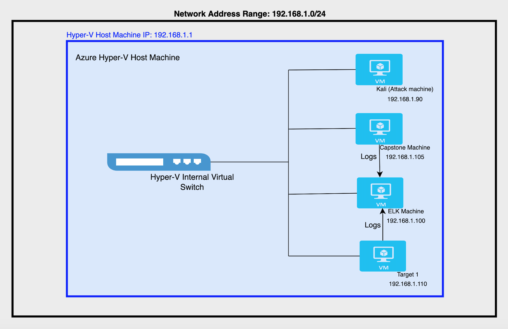
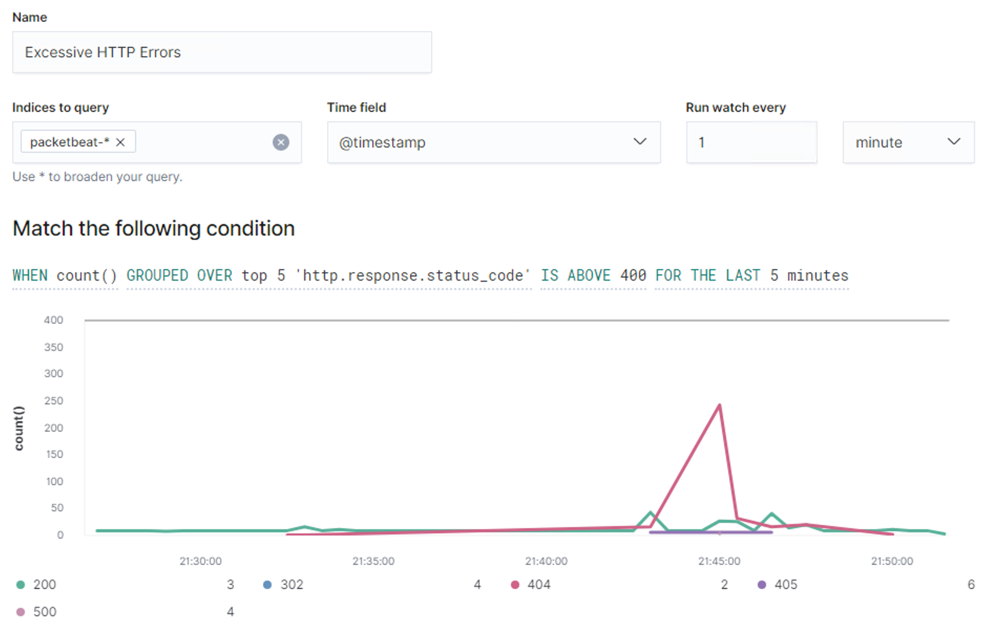
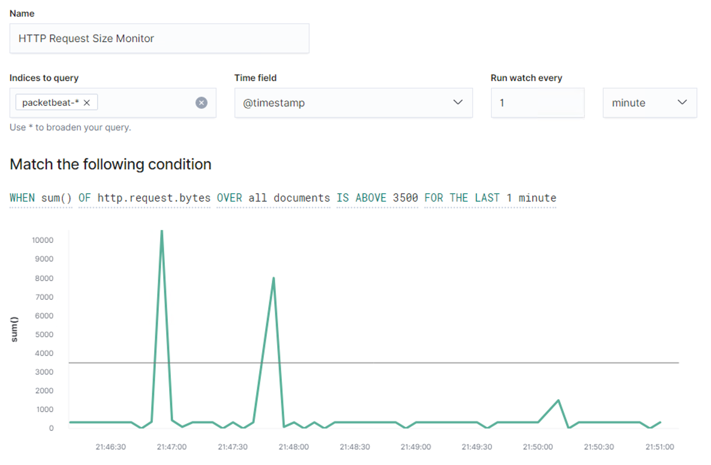
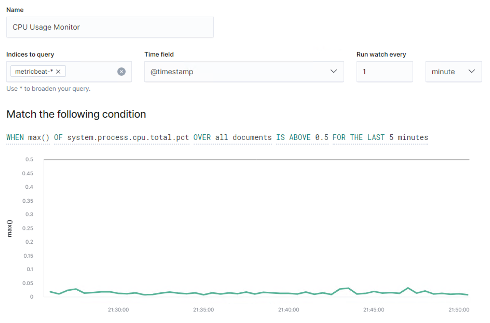

# Blue Team: Summary of Operations

## Table of Contents
- Network Topology
- Description of Targets
- Monitoring the Targets

### Network Topology
The network topology is as presented below:



The following machines were identified on the network:
- Kali
  - **Operating System**: Kali GNU/Linux Rolling
  - **Purpose**: Attacking Machine/Pen-Test Machine
  - **IP Address**: 192.168.1.90
- Capstone (server1)
  - **Operating System**: Ubuntu 18.04.1 LTS
  - **Purpose**: Alert Testing
  - **IP Address**: 192.168.1.105
- ELK
  - **Operating System**: Ubuntu 18.04.4 LTS
  - **Purpose**: ELK Stack machine with FileBeat, MetricBeat and PacketBeat
  - **IP Address**: 192.168.1.100
- Target 1 (target1)
  - **Operating System**: Debian GNU/Linux 8 (jessie)
  - **Purpose**: Attack Target, Vulnerable Wordpress Server
  - **IP Address**: 192.168.1.110

### Description of Targets
The target of this attack was: `Target 1` (IP Address: 192.168.1.110)

Target 1 is an Apache web server and has SSH enabled, so ports 80 and 22 are possible ports of entry for attackers. As such, the following alerts have been implemented:
- Excessive HTTP Errors
- HTTP Request Size Monitor
- CPU Usage Monitor

### Monitoring the Targets

Traffic to these services should be carefully monitored. To this end, I have implemented the alerts below:

#### Excessive HTTP Errors

Excessive HTTP Errors is implemented as follows:

  ```
  WHEN count() GROUPED OVER top 5 'http.response.status_code' IS ABOVE 400 FOR THE LAST 5 minutes
  ```

  - **Metric**: WHEN count() GROUPED OVER top 5 'http.response.status_code'
  - **Threshold**: Above 400
  - **Vulnerability Mitigated**: Brute Force/Enumeration
  - **Reliability**: It's a high reliability alert. Having too many error codes of above 400 means some potential malicious activity.
  
  Screenshot:

  

#### HTTP Request Size Monitor
HTTP Request Size Monitor is implemented as follows:

  ```
  WHEN sum() of http.request.bytes OVER all documents IS ABOVE 3500 FOR THE LAST 1 minute
  ```

  - **Metric**: WHEN sum() of http.request.bytes OVER all documents
  - **Threshold**: Above 3500
  - **Vulnerability Mitigated**: It indicates higher traffic event such as brute force, port scan, enumeration, DoS or any other attacks. 
  - **Reliability**: It's a medium reliability alert. It may create false alerts sometimes as even normal non-malicious http requests could lead to false alert.

  Screenshot:

  

#### CPU Usage Monitor
CPU Usage Monitor is implemented as follows:

  ```
  WHEN max() OF system.process.cpu.total.pct OVER all documents IS ABOVE 0.5 FOR THE LAST 5 minutes
  ```

  - **Metric**: WHEN max() OF system.process.cpu.total.pct OVER all documents
  - **Threshold**: ABOVE 0.5
  - **Vulnerability Mitigated**: Brute force or any attacks that take excessive CPU resource.
  - **Reliability**: It's a low reliability atert. It wouldn't create an alert even if an attack happens that doesn't consume much CPU resource. 

  Screenshot:

  
