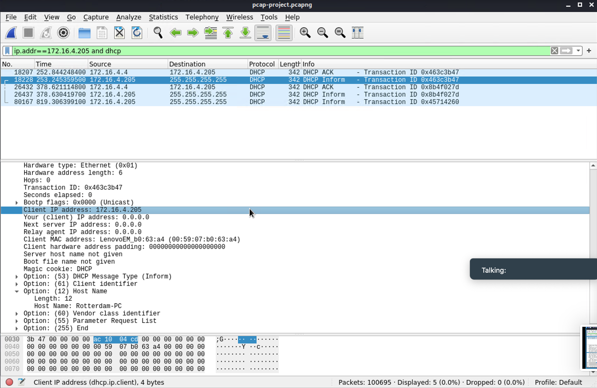

# Network Forensic Analysis Report

## Time Thieves 
I inspected my traffic capture to answer the following questions:

1. What is the domain name of the users' custom site?

    `Answer:` Frank-n-Ted-DC.frank-n-ted.com 

    Screenshot:
    

2. What is the IP address of the Domain Controller (DC) of the AD network?

    `Answer:` 10.6.12.12

    Screenshot:
    

3. What is the name of the malware downloaded to the 10.6.12.203 machine?

   - Once you have found the file, export it to your Kali machine's desktop.

    `Answer:` june11.dll 

    Screenshot:
    

4. Upload the file to [VirusTotal.com](https://www.virustotal.com/gui/). 

    `Anwser:` The screenshot is presented below: 

    Screenshot:
    

5. What kind of malware is this classified as?

    `Answer:` Trojan 

    Screenshot:
    

---

## Vulnerable Windows Machine

1. Find the following information about the infected Windows machine:
    - Host name: Rotterdam-PC

    Screenshot:
    

    - IP address: 172.16.4.205 

    Screenshot:
     

    - MAC address: 00:59:07:b0:63:a4 

    Screenshot:
    
    
2. What is the username of the Windows user whose computer is infected?

    `Answer:` matthijs.devries

    Screenshot:
    

3. What are the IP addresses used in the actual infection traffic?

    `Answer:` 172.16.4.205, 185.243.115.84, 166.62.11.64 

    Screenshot:
    

4. As a bonus, retrieve the desktop background of the Windows host.

    `Answer:` The screenshot is as follows: 

    Screenshot:
    

---

## Illegal Downloads

1. Find the following information about the machine with IP address `10.0.0.201`:
    - MAC address: 00:16:17:18:66:c8 

    Screenshot:
    

    - Windows username: elmer.blanco 

    Screenshot:
    

    - Computer host name: Windows NT 10 

    Screenshot:
    

2. Which torrent file did the user download?

    `Answer:` Betty_boop_rhythm_on_the_reservation.avi.torrent 

    Screenshot:
    

